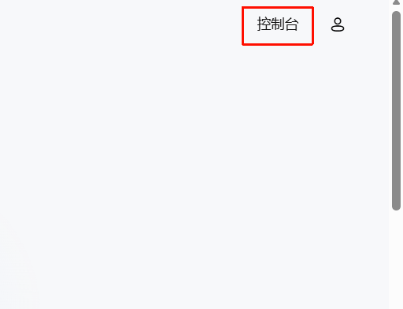
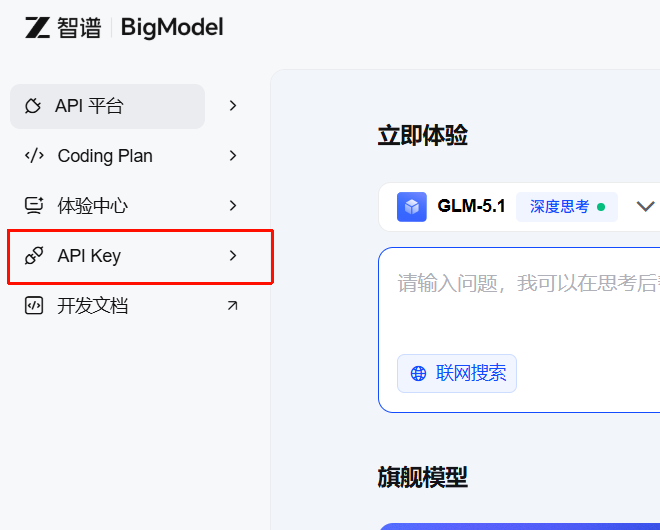
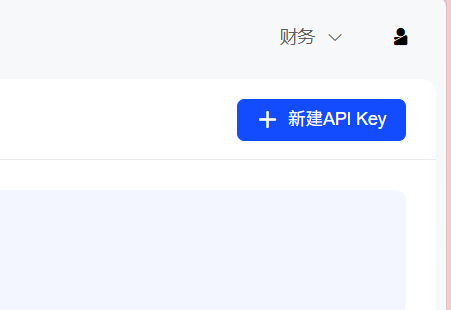
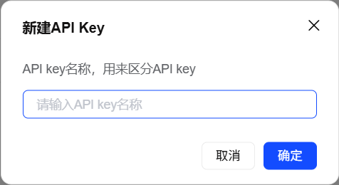
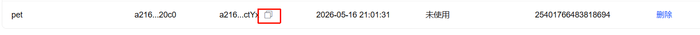

# 免费API获取教程

**1.访问质谱官网完成注册https://open.bigmodel.cn/**

**2.点击右上角控制台**

**3.点击左侧的API key**

**4.新建**

**5.这里随便填**

**6.中间有个复制图标，复制下来**

**7.填写，到我们的接入api的菜单栏，从上到下依次填写**

https://open.bigmodel.cn/api/paas/v4/chat/completions
（刚刚复制的那一串）
glm-4-flash

然后就可以啦