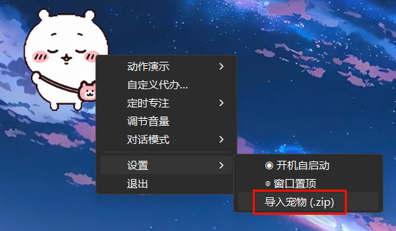
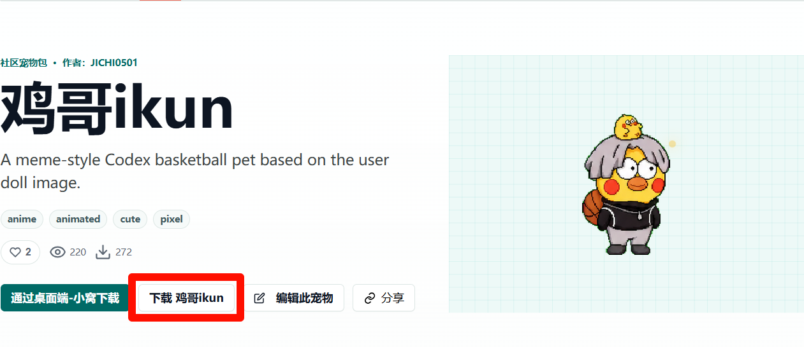
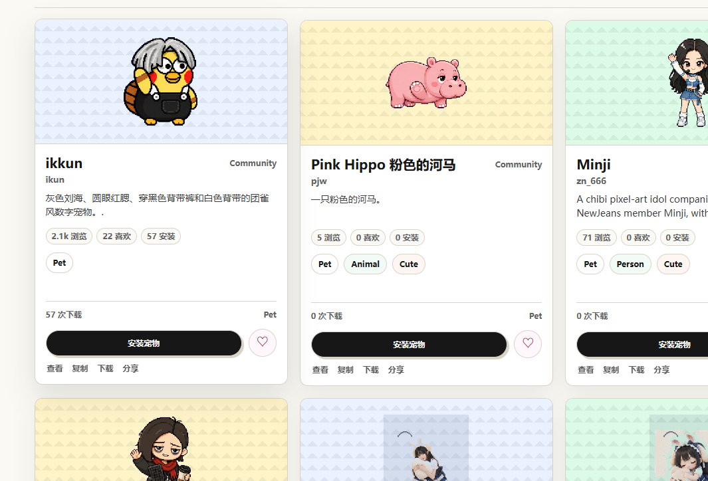
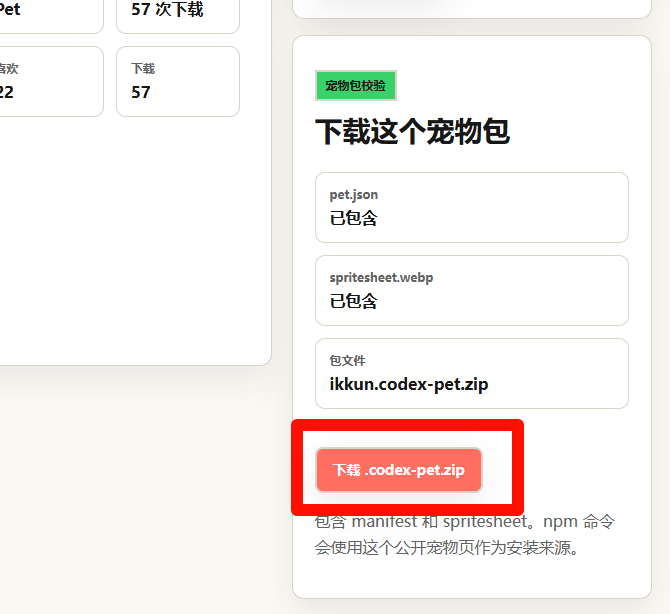

# 导入教程

**根据图片的选项，就会自动打开你的文件夹，然后你找到你刚刚下载的.zip文件导入进去就可以了**

---

# Codex Pet 下载教程

链接🔗：https://codexpet.xyz/zh/pets/

**1.选择一个喜欢的宠物然后点击小眼睛**

**2.点击下载，就是绿色框旁边的那个按钮**

---

# CodexPets下载教程

链接🔗：https://codex-pet.org/zh/

这个简单，这个没有那么多的按钮

**1.看上哪个直接点击任意位置就好**

**2.点击下载安装包即可**

